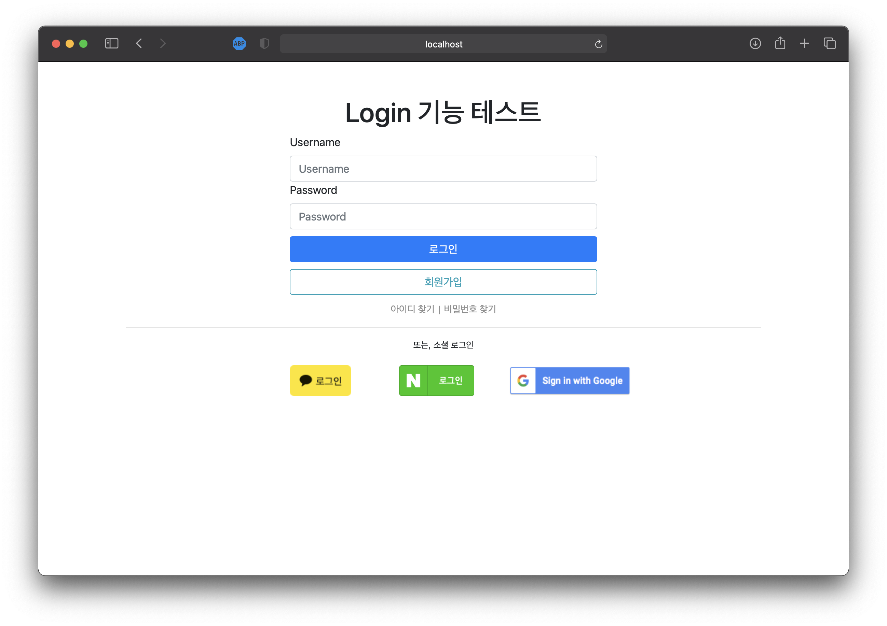

# 🔐 Spring Boot를 활용한 로그인 기능 구현
`Spring boot`, `Spring Security`, `OAuth2.0`

----
### 프로젝트 설명
자주 쓰이는 소셜(`구글`, `카카오`, `네이버`) 로그인 기능을 구현했습니다.

---
### 실행화면
- 소셜 로그인 화면
- 로그인 성공 화면

---
### 소셜 로그인 화면

`카카오`, `네이버`, `구글` 로그인 버튼이 있고, 버튼을 클릭하면 각 서비스의 로그인 인증 요청 API를 호출합니다.

---
### 로그인 성공 화면

로그인 인증이 완료된 사용자의 정보(`프로필 사진`, `사용자 이름`)를 간단하게 보여주는 페이지를 꾸며봤습니다.
